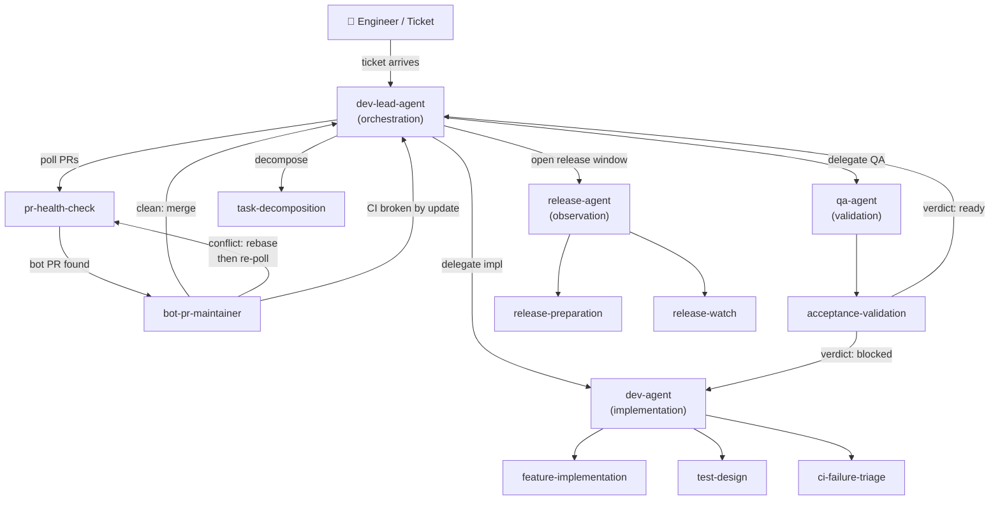

# AI Development Configuration Kit — Complete Overview

This document provides a complete overview of both configuration kits in this repository.

## What is This Kit?

A **production-minded, generic-first configuration starter kit** for structuring AI-assisted software development. Two parallel kits are provided — one for Windsurf Cascade and one for Claude Code — both expressing the same engineering philosophy using each tool's native layers.

---

## Claude Code Configuration Kit

### Overview

The Claude Code kit lives under `claude-code-config/` and is designed from scratch for Claude Code's native configuration system. It uses shell-based hooks, `CLAUDE.md` as the project truth document, Claude Code's Skills system, and a four-agent role layer for complex multi-step tasks.

### Layer Architecture

```
┌─────────────────────────────────────────────────────────────────────┐
│              ~/.claude/CLAUDE.md (global, 17 sections)              │
│            Constitution · Policy · Automation Rules                 │
│  global/project split · safe-impl · testing · commit policy ·      │
│  PR policy · CI triage · auto-merge · bot-PR · push gate ·         │
│  preconditions · release ops · delegation model · time-layer ·     │
│  skill guide · workflow state · circuit breaker · forbidden actions │
├─────────────────────────────────────────────────────────────────────┤
│         .claude/CLAUDE.md (per-project, extends global)             │
│  identity · architecture · commands · tooling · source-of-truth     │
└───────────────────────────────┬─────────────────────────────────────┘
                                │ governs
┌───────────────────────────────▼─────────────────────────────────────┐
│                  Role Layer  (.claude/agents/)                       │
│                                                                     │
│  ┌─────────────────┐  delegates  ┌────────────────┐                 │
│  │  dev-lead-agent │────────────►│   dev-agent    │                 │
│  │  (orchestrate)  │             │  (implement)   │                 │
│  └────────┬────────┘             └────────────────┘                 │
│           │         delegates  ┌─────────────────┐                  │
│           ├──────────────────►│    qa-agent      │                  │
│           │                   │  (validate)      │                  │
│           │                   └─────────────────┘                   │
│           │         hands off ┌─────────────────┐                   │
│           └─────────────────►│  release-agent   │                   │
│                               │  (observe)       │                   │
│                               └─────────────────┘                   │
└───────────────────────────────┬─────────────────────────────────────┘
                                │ invokes
┌───────────────────────────────▼─────────────────────────────────────┐
│                 Method Layer  (.claude/skills/)                      │
│                                                                     │
│  Orchestration skills         Implementation skills                  │
│  ─────────────────            ────────────────────                   │
│  task-decomposition           feature-implementation                 │
│  pr-health-check              test-design                            │
│  bot-pr-maintainer            ci-failure-triage                      │
│                               python-mypy-debugging                  │
│  Validation skills            python-ruff-fixing                     │
│  ─────────────────            python-precommit-repair                │
│  acceptance-validation                                               │
│                               Release skills                         │
│  Gate skills (command-like)   ─────────────                          │
│  ───────────────────────      release-preparation                    │
│  pr-readiness                 release-watch                          │
│  release-readiness                                                   │
│  dependency-upgrade-review                                           │
└───────────────────────────────┬─────────────────────────────────────┘
                                │ queries
┌───────────────────────────────▼─────────────────────────────────────┐
│                Capability Layer  (.mcp.json)                         │
│                                                                     │
│  Always-on                    Disabled by default                    │
│  ──────────                   ──────────────────                     │
│  github  (code_repository,    clickup  (issue_tracking)              │
│           issue_tracking)     slack    (communication)               │
│  fetch   (utility)            codecov  (coverage_reporting)          │
│  sonarqube (static_analysis)  datadog  (observability)               │
└───────────────────────────────┬─────────────────────────────────────┘
                                │ enforces
┌───────────────────────────────▼─────────────────────────────────────┐
│            Enforcement Layer  (.claude/hooks/ + settings.json)       │
│                                                                     │
│  PreToolUse[Bash]             PostToolUse[Write|Edit]                │
│  ────────────────             ──────────────────────                 │
│  block_dangerous_commands     quality_gate                           │
│  freshness-gate                                                      │
│  full-test-gate               PostToolUse[Bash]                      │
│  precommit-gate               ────────────────                       │
│                               audit_log                              │
│                               completion-contract                    │
└─────────────────────────────────────────────────────────────────────┘
      (circuit-breaker-gate is now utility-only; called by skills explicitly)
```

### Global vs Project Configuration

The Claude Code kit is designed for **global personal installation** at `~/.claude/`.
This makes the behavioral rules, agents, skills, and hooks available across all your
projects without per-repo setup. Each project then adds a lightweight `.claude/CLAUDE.md`
for its specific overrides.

#### Configuration layering

```
~/.claude/CLAUDE.md          ← global (this kit): behavioral rules, policies, agent model
    ↓ read first
.claude/CLAUDE.md            ← project: identity, architecture, commands, tooling
    ↓ project values override global values
Claude Code applies the merged result
```

#### What lives at each layer

| Section | Global `~/.claude/CLAUDE.md` | Project `.claude/CLAUDE.md` |
|---|---|---|
| Safe Implementation Policy | ✓ defined here | rarely overridden |
| Commit / PR / CI Policy | ✓ defined here | add project-specific merge strategy |
| Agent Delegation Model | ✓ defined here | rarely overridden |
| Workflow State / Circuit Breaker | ✓ defined here | rarely overridden |
| Skill Invocation Guide | ✓ generic skills listed | add language-specific repair skills |
| Repository Identity | — | ✓ defined here |
| Architecture Constraints | — | ✓ defined here |
| Package and Build Commands | — | ✓ defined here |
| Testing Tooling | — | ✓ runner, coverage tool, threshold |
| Type Checker / Linter | — | ✓ tool name, config location |
| Source-of-Truth Systems | — | ✓ issue tracker, wiki, Slack |

#### Install commands

```bash
# One-time global install
cp -r claude-code-config/.claude ~/.claude
cp claude-code-config/CLAUDE.md ~/.claude/CLAUDE.md
cp claude-code-config/settings.json ~/.claude/settings.json
cp claude-code-config/.mcp.json ~/.claude/.mcp.json
chmod +x ~/.claude/hooks/*.sh

# Optional: personal env overrides
cp ~/.claude/hooks/config.env ~/.claude/config.env

# Per-project customization (in each repo)
mkdir -p .claude
# Create .claude/CLAUDE.md with Repository Identity, Architecture, Commands, etc.
echo ".claude/.current-ticket" >> .gitignore
```

### Directory Structure (after global install)

```
~/.claude/                               # Global personal installation
├── CLAUDE.md                            # Global constitution (behavioral rules, policies)
├── settings.json                        # Hook wiring (PreToolUse / PostToolUse)
├── .mcp.json                            # MCP capability map (always-active + project-opt-in)
├── config.env                           # Personal env var overrides (CLAUDE_* variables)
├── agents/                              # Sub-agent role definitions
│   ├── dev-lead-agent.md                # Orchestration: decomposition, PR decisions, bot PR coordination
│   ├── dev-agent.md                     # Implementation: code, tests, local validation, CI repair
│   ├── qa-agent.md                      # Validation: acceptance criteria, adversarial testing, regressions
│   └── release-agent.md                 # Observation: release notes, pipeline watch, outcome summary
├── hooks/
│   ├── block_dangerous_commands.sh      # PreToolUse[Bash]: blocks rm -rf, force push, curl|bash, etc.
│   ├── quality_gate.sh                  # PostToolUse[Write|Edit]: debug detection, TODO hygiene, file size
│   ├── audit_log.sh                     # PostToolUse[Bash]: append-only JSONL audit log with rotation
│   ├── freshness-gate.sh                # PreToolUse[Bash]: blocks commit/push if branch is behind remote
│   ├── full-test-gate.sh                # PreToolUse[Bash]: blocks push if tests not re-run after changes
│   ├── precommit-gate.sh                # PreToolUse[Bash]: runs pre-commit before push, blocks on failure
│   ├── completion-contract.sh           # PostToolUse[Bash]: exit 2 when TEST RUNNER produces failure output
│   ├── workflow-state.sh                # Utility: atomic read/write/archive per-ticket phase state
│   ├── circuit-breaker-gate.sh          # Utility: check/record-failure/record-success/reset per ticket
│   ├── decision-log.sh                  # Utility: structured decision audit (record/tail/query)
│   └── config.env                       # Template: copy this to ~/.claude/config.env and customize
└── skills/

your-repo/                               # Per-project overrides (lightweight)
├── .claude/
│   ├── CLAUDE.md                        # Project identity, architecture, commands, tooling
│   └── .current-ticket                  # Active ticket ref (gitignored, written by ticket-pickup-check)
└── .mcp.json                            # (optional) project-specific MCP server overrides
```

### Source directory (this repo)

```
claude-code-config/
├── CLAUDE.md                            # Global constitution template
├── settings.json                        # Hook wiring (PreToolUse / PostToolUse)
├── .mcp.json                            # MCP capability map
└── .claude/
        ├── ticket-intake/SKILL.md               # Auto-used: scan tracker, discuss requirements, mark Accepted
        ├── task-decomposition/SKILL.md          # Auto-used: ticket → sub-tickets with states and agent assignments
        ├── ticket-pickup-check/SKILL.md         # Auto-used: state/blocker/assignee gate before implementation
        ├── dev-impl-loop/SKILL.md               # Auto-used: implement → test → QA handoff → PR (5 phases)
        ├── feature-implementation/SKILL.md      # Auto-used: test-first feature implementation (6 phases)
        ├── test-design/SKILL.md                 # Auto-used: behavior-first test design
        ├── code-review-prep/SKILL.md            # Auto-used: pre-PR quality gate + description generation
        ├── ci-failure-triage/SKILL.md           # Auto-used: 6-phase CI failure triage
        ├── python-mypy-debugging/SKILL.md       # Auto-used: mypy error diagnosis and safe repair
        ├── python-ruff-fixing/SKILL.md          # Auto-used: ruff violation fixing with auto-fix review
        ├── python-precommit-repair/SKILL.md     # Auto-used: pre-commit repair without --no-verify
        ├── acceptance-validation/SKILL.md       # Auto-used: acceptance criteria + adversarial validation
        ├── bot-pr-maintainer/SKILL.md           # Auto-used: clean merge / rebase / escalate for bot PRs
        ├── pr-feedback-response/SKILL.md        # Auto-used: triage review comments, fix, re-request review
        ├── post-merge-close/SKILL.md            # Auto-used: close ticket, delete branch, notify reporter
        ├── workflow-resume/SKILL.md             # Command-like (/workflow-resume): resume interrupted session
        ├── pr-readiness/SKILL.md                # Command-like (/pr-readiness): full PR readiness checklist
        ├── pr-health-check/SKILL.md             # Command-like (/pr-health-check): classify and act on all open PRs
        ├── release-readiness/SKILL.md           # Command-like (/release-readiness): release gate checklist
        ├── release-preparation/SKILL.md         # Command-like (/release-preparation): notes, version config
        ├── release-watch/SKILL.md               # Auto-used: pipeline observation and outcome summary
        └── dependency-upgrade-review/SKILL.md   # Command-like: dependency upgrade risk classification
```

> **Deep dive:** For design rationale, architectural concerns, hook design principles,
> skill-first polling diagrams, and MCP capability routing, see
> [`docs/claude-code-agent-system.md`](docs/claude-code-agent-system.md).

### Key Differences from Windsurf Cascade Kit

| Aspect | Windsurf Cascade | Claude Code |
|--------|-----------------|-------------|
| Project truth | `AGENTS.md` | `CLAUDE.md` |
| Config directory | `.windsurf/` | `.claude/` |
| Hook language | Python (`.py`) | Shell (`.sh`) |
| Hook trigger config | `.windsurf/hooks.json` | `settings.json` (PreToolUse/PostToolUse) |
| Hook triggers | `post_write_code`, `pre_run_command` | `PreToolUse[Bash]`, `PostToolUse[Write\|Edit\|Bash]` |
| Workflows | `.windsurf/workflows/*.md` | Command-like skills (`/pr-readiness`, etc.) |
| Rules | `.windsurf/rules/*.md` | Inline sections in `CLAUDE.md` |
| MCP config | `.windsurf/mcp_config.json` | `.mcp.json` |

### CLAUDE.md Sections

The global `~/.claude/CLAUDE.md` covers 17 sections organized in three groups.
Project-specific sections (identity, architecture, commands, tooling, source-of-truth)
live in the per-project `.claude/CLAUDE.md`.

**Engineering policy (global)**
1. Global vs Project Configuration *(new: explains the two-file layering model)*
2. Safe Implementation Policy
3. Testing Expectations *(principles only; tooling in project file)*
4. Type Checking Policy *(language-agnostic principles; tool in project file)*
5. Linting and Formatting Policy *(principles only; tool in project file)*
6. Commit Policy
7. Pull Request Policy
8. CI/CD Triage Expectations
9. MCP-Backed Systems

**Workflow gates and automation policy (global)**
10. Auto-Merge Policy
11. Bot PR Policy
12. Push Gate Policy
13. Development Preconditions
14. Release Operations Policy
15. Time-Layer Design (skill-first polling and scheduling)

**Skill, agent, and state coordination (global)**
16. Environment Variable Reference
17. Agent Delegation Model
18. Skill Invocation Guide
19. Workflow State Management
20. Circuit Breaker Policy
21. What Claude Code Must Never Do

**Project-level `.claude/CLAUDE.md` sections (per-repo)**
- Repository Identity
- Architecture Constraints
- Package and Build Commands
- Testing Tooling
- Type Checker and Linter Tooling
- Source-of-Truth Systems
- Merge Strategy
- Polling Intervals
- Language-Specific Repair Skills

### Role Layer (.claude/agents/)

The Claude Code kit includes a four-agent role model for complex multi-step tasks:

| Agent | File | Scope |
|-------|------|-------|
| `dev-lead-agent` | `agents/dev-lead-agent.md` | Orchestration, task decomposition, PR review, merge decisions, bot PR coordination |
| `dev-agent` | `agents/dev-agent.md` | Implementation, test writing, local validation, focused CI repair |
| `qa-agent` | `agents/qa-agent.md` | Acceptance validation, adversarial testing, regression checks, pre-merge verdict |
| `release-agent` | `agents/release-agent.md` | Release note drafting, version config updates, pipeline observation, outcome summary |

**Delegation rules (enforced by CLAUDE.md Agent Delegation Model section):**
- `dev-lead-agent` orchestrates; it does not write implementation code.
- `dev-agent` implements; it does not approve or merge PRs.
- `qa-agent` validates from outside; it does not write fixes.
- `release-agent` observes; it does not trigger releases or merge PRs.

**Agent delegation flow:**



### Hook Wiring (settings.json)

Seven hooks wired across two trigger points. The push gate sequence is the most important to understand:

```
 Claude Code issues: git push ...
         │
         ▼  PreToolUse[Bash] fires — sequential chain
 ┌───────────────────────────────────────────────────────┐
 │ 1. block_dangerous_commands.sh                        │
 │    Pattern match against known destructive commands.  │
 │    BLOCKED (exit 2) → stop. Command never runs.       │
 └───────────────────────┬───────────────────────────────┘
                         │ pass
 ┌───────────────────────▼───────────────────────────────┐
 │ 2. freshness-gate.sh                                  │
 │    git fetch origin; count commits behind upstream.   │
 │    BLOCKED (exit 2) → run git pull --rebase first.    │
 └───────────────────────┬───────────────────────────────┘
                         │ pass
 ┌───────────────────────▼───────────────────────────────┐
 │ 3. full-test-gate.sh                                  │
 │    Check sentinel file age vs. newest source file.    │
 │    BLOCKED (exit 2) → re-run the full test suite.     │
 └───────────────────────┬───────────────────────────────┘
                         │ pass
 ┌───────────────────────▼───────────────────────────────┐
 │ 4. precommit-gate.sh                                  │
 │    Run pre-commit run --all-files.                    │
 │    BLOCKED (exit 2) → fix violations; use             │
 │                        python-precommit-repair skill. │
 └───────────────────────┬───────────────────────────────┘
                         │ all pass
         ▼  git push executes
         │
         ▼  PostToolUse[Bash] fires
 ┌───────────────────────────────────────────────────────┐
 │ 5. audit_log.sh      — log the push to JSONL          │
 │ 6. completion-contract.sh — scan output for FAILED,   │
 │    ERROR, etc. Warn if failure markers present.       │
 │ 7. circuit-breaker-gate.sh — detect failure markers,  │
 │    record against active ticket, open circuit if      │
 │    consecutive failure threshold is exceeded.         │
 └───────────────────────────────────────────────────────┘
```

Seven hooks wired across two trigger points (circuit-breaker removed from PostToolUse; now utility-only):

| Trigger | Matcher | Hook | Purpose |
|---------|---------|------|---------|
| `PreToolUse` | `Bash` | `block_dangerous_commands.sh` | Block `rm -rf`, force push, `curl\|bash`, etc. |
| `PreToolUse` | `Bash` | `freshness-gate.sh` | Block commit/push if branch is behind remote |
| `PreToolUse` | `Bash` | `full-test-gate.sh` | Block push if tests not re-run after source changes |
| `PreToolUse` | `Bash` | `precommit-gate.sh` | Run `pre-commit --all-files` before push; block on failure |
| `PostToolUse` | `Write\|Edit` | `quality_gate.sh` | Debug detection, TODO hygiene, file size checks |
| `PostToolUse` | `Bash` | `audit_log.sh` | Append-only JSONL audit log with rotation |
| `PostToolUse` | `Bash` | `completion-contract.sh` | Exit 2 when a test-runner command produces failure output |

### MCP Capability Map (.mcp.json)

Servers are tiered: **always-active** apply to all projects; **project-opt-in** are
disabled by default and enabled per-project by providing credentials.

| Server | Capabilities | Tier | Notes |
|--------|-------------|------|-------|
| `fetch` | `fetch` | always-active | Utility: URL fetching |
| `github` | `code_repository`, `issue_tracking` | always-active | Primary when `CLAUDE_ISSUE_TRACKER=github` |
| `sonarqube` | `static_analysis` | project-opt-in | Quality gate; enable with `SONAR_TOKEN` + `SONAR_HOST_URL` |
| `clickup` | `issue_tracking` | project-opt-in | Enable when `CLAUDE_ISSUE_TRACKER=clickup`; uses `chisanan232/clickup-mcp-server` |
| `slack` | `communication` | project-opt-in | Enable with `SLACK_BOT_TOKEN`; uses `chisanan232/slack-mcp-server` |
| `codecov` | `coverage_reporting` | project-opt-in | Enable when coverage trend tracking is needed |
| `playwright` | `browser_automation` | project-opt-in | Enable for web UI projects; used by `qa-agent` for acceptance testing |
| `datadog` | `observability` | project-opt-in | Enable for incident and log triage |

---

## Windsurf Cascade Configuration Kit

A **production-minded, generic-first Windsurf Cascade configuration starter kit** for structuring AI-assisted software development.

## Architecture

### Six-Layer Model

```
┌─────────────────────────────────────────────────────────────┐
│                        AGENTS.md                            │
│              Project Truth & Declarative Context            │
│  (languages, tools, commands, conventions, structure)       │
└─────────────────────────────────────────────────────────────┘
                              ↓
┌─────────────────────────────────────────────────────────────┐
│                          Rules                              │
│            Short, Durable Behavioral Constraints            │
│     (coding standards, testing policy, commit policy)       │
└─────────────────────────────────────────────────────────────┘
                              ↓
┌─────────────────────────────────────────────────────────────┐
│                          Skills                             │
│           Procedural Strategy & Reusable Methods            │
│   (feature implementation, test design, CI triage)          │
└─────────────────────────────────────────────────────────────┘
                              ↓
┌─────────────────────────────────────────────────────────────┐
│                       MCP Servers                           │
│         External Capability Providers & Data Access         │
│  (GitHub, Slack, SonarQube, Codecov, JIRA, observability)  │
└─────────────────────────────────────────────────────────────┘
                              ↓
┌─────────────────────────────────────────────────────────────┐
│                        Workflows                            │
│              Manually Triggered Runbooks                    │
│    (PR readiness, release readiness, dep upgrades)          │
└─────────────────────────────────────────────────────────────┘
                              ↓
┌─────────────────────────────────────────────────────────────┐
│                          Hooks                              │
│          Enforcement, Interception & Auditing               │
│   (quality gate, dangerous commands, audit logging)         │
└─────────────────────────────────────────────────────────────┘
```

### Layer Responsibilities

| Layer           | Purpose                    | Examples                          | When to Use                 |
|-----------------|----------------------------|-----------------------------------|-----------------------------|
| **AGENTS.md**   | Project truth              | Languages, tools, commands        | Facts about the project     |
| **Rules**       | Behavioral constraints     | Coding standards, testing policy  | Always-on constraints       |
| **Skills**      | Procedural strategies      | Feature implementation, CI triage | Multi-step procedures       |
| **MCP Servers** | External capability access | GitHub, Slack, SonarQube, Codecov | Access to external systems  |
| **Workflows**   | Manual runbooks            | PR readiness, release checklist   | Manual milestone checklists |
| **Hooks**       | Automated enforcement      | Quality gate, command blocking    | Automated validation        |

## Complete File Structure

```
your-repository/
├── AGENTS.md                                    # Root project context
├── GETTING-STARTED.md                           # Quick start guide
├── CONFIGURATION-OVERVIEW.md                    # This file
├── README.md                                    # Installation guide
│
├── .windsurf/                                   # Windsurf configuration
│   ├── rules/                                   # Behavioral constraints
│   │   ├── coding-standards.md
│   │   ├── testing-policy.md
│   │   ├── commit-policy.md
│   │   ├── pr-policy.md
│   │   └── ci-policy.md
│   │
│   ├── skills/                                  # Reusable procedures
│   │   ├── feature-implementation/
│   │   │   └── SKILL.md
│   │   ├── test-design/
│   │   │   └── SKILL.md
│   │   ├── code-review-prep/
│   │   │   └── SKILL.md
│   │   ├── ci-failure-triage/
│   │   │   └── SKILL.md
│   │   ├── coverage-regression-repair/
│   │   │   └── SKILL.md
│   │   ├── python-mypy-debugging/
│   │   │   └── SKILL.md
│   │   ├── python-ruff-fixing/
│   │   │   └── SKILL.md
│   │   └── python-precommit-repair/
│   │       └── SKILL.md
│   │
│   ├── workflows/                               # Manual runbooks
│   │   ├── pr-readiness.md
│   │   ├── release-readiness.md
│   │   └── dependency-upgrade-review.md
│   │
│   └── hooks.json                               # Hook configuration
│
├── hooks/                                       # Hook scripts
│   ├── quality_gate.py
│   ├── block_dangerous_commands.py
│   ├── audit_log.py
│   └── README.md
│
├── docs/                                        # Documentation
│   ├── architecture-rationale.md
│   ├── customization-guide.md
│   ├── language-overlays.md
│   ├── mcp-integration.md
│   └── mcp-setup-guide.md
│
└── examples/                                    # Example configurations
    ├── mcp_config.json                          # Example MCP configuration
    ├── backend/
    │   └── AGENTS.md
    ├── frontend/
    │   └── AGENTS.md
    └── infra/
        └── AGENTS.md
```

## Component Inventory

### Core Components (Required)

| Component        | Location                              | Purpose                   | Customize?          |
|------------------|---------------------------------------|---------------------------|---------------------|
| Root AGENTS.md   | `/AGENTS.md`                          | Project truth             | **YES** (essential) |
| Coding Standards | `.windsurf/rules/coding-standards.md` | Code quality expectations | Review              |
| Testing Policy   | `.windsurf/rules/testing-policy.md`   | Testing requirements      | Review              |
| Commit Policy    | `.windsurf/rules/commit-policy.md`    | Commit conventions        | Review              |
| PR Policy        | `.windsurf/rules/pr-policy.md`        | PR requirements           | Review              |
| CI Policy        | `.windsurf/rules/ci-policy.md`        | CI/CD expectations        | Review              |

### Generic Skills (Reusable)

| Skill                      | Purpose                       | Language-Agnostic? |
|----------------------------|-------------------------------|--------------------|
| feature-implementation     | Implement new features safely | ✓ Yes              |
| test-design                | Design comprehensive tests    | ✓ Yes              |
| code-review-prep           | Prepare PRs for review        | ✓ Yes              |
| ci-failure-triage          | Diagnose and fix CI failures  | ✓ Yes              |
| coverage-regression-repair | Fix coverage regressions      | ✓ Yes              |

### Language-Specific Skills (Python)

| Skill                   | Purpose                 | Language |
|-------------------------|-------------------------|----------|
| python-mypy-debugging   | Fix MyPy type errors    | Python   |
| python-ruff-fixing      | Fix Ruff linting issues | Python   |
| python-precommit-repair | Fix pre-commit failures | Python   |

### Workflows (Manual Checklists)

| Workflow                  | Purpose                   | When to Use          |
|---------------------------|---------------------------|----------------------|
| pr-readiness              | Ensure PR is complete     | Before submitting PR |
| release-readiness         | Ensure release is ready   | Before releasing     |
| dependency-upgrade-review | Review dependency updates | When upgrading deps  |

### Hooks (Automated)

| Hook                        | Purpose                    | Blocking? |
|-----------------------------|----------------------------|-----------|
| quality_gate.py             | Lightweight quality checks | No        |
| block_dangerous_commands.py | Block dangerous commands   | Yes       |
| audit_log.py                | Log command execution      | No        |

### Documentation

| Document                  | Purpose                    | Audience                |
|---------------------------|----------------------------|-------------------------|
| GETTING-STARTED.md        | Quick start guide          | New users               |
| CONFIGURATION-OVERVIEW.md | Complete overview          | All users               |
| architecture-rationale.md | Design decisions           | Advanced users          |
| customization-guide.md    | How to customize           | Maintainers             |
| language-overlays.md      | Language-specific guidance | Multi-language projects |
| mcp-integration.md        | MCP architecture & design  | All users               |
| mcp-setup-guide.md        | MCP setup walkthrough      | New users               |

## Customization Priority

### Priority 1: Essential (Do First)

1. **Fill in AGENTS.md** with project specifics
2. **Verify commands** work in your environment
3. **Set coverage threshold** for your project
4. **Define commit style** for your team
5. **Locate PR template** in your repository
6. **Configure MCP servers** for essential systems (GitHub, Slack) - see `docs/mcp-setup-guide.md`

**Time: 1-2 hours (including MCP setup)**

### Priority 2: Review (Do Soon)

1. **Review all Rules** and adjust if needed
2. **Review all Skills** and add project notes
3. **Test configuration** with Windsurf Cascade
4. **Gather team feedback** on initial setup

**Time: 2 hours**

### Priority 3: Enhance (Do Later)

1. **Add project-specific Rules** if needed
2. **Add project-specific Skills** if needed
3. **Customize Workflows** for your process
4. **Tune Hooks** for your environment

**Time: 4 hours**

### Priority 4: Iterate (Ongoing)

1. **Monitor usage** and gather feedback
2. **Adjust based on pain points**
3. **Add missing pieces** as discovered
4. **Remove unused components**

**Time: 1 hour/month**

## Usage Patterns

### Pattern 1: Feature Development

```
1. Developer starts feature work
2. Windsurf Cascade invokes feature-implementation skill
3. Skill consults AGENTS.md for project conventions
4. Skill follows coding-standards and testing-policy rules
5. Developer writes code with AI assistance
6. quality_gate hook runs after code is written
7. Developer uses code-review-prep skill before PR
8. Developer runs pr-readiness workflow
9. Developer submits PR
```

### Pattern 2: CI Failure Repair

```
1. CI fails on PR
2. Developer asks Windsurf Cascade to fix
3. Cascade invokes ci-failure-triage skill
4. Skill identifies failure type (test, lint, type)
5. Skill invokes language-specific skill if needed
6. Skill fixes issue following safe implementation policy
7. Developer commits fix with appropriate message
8. CI passes
```

### Pattern 3: Release Preparation

```
1. Developer ready to release
2. Developer runs /release-readiness workflow
3. Workflow guides through checklist
4. Developer verifies all steps complete
5. Developer creates release
6. Developer deploys to production
7. Developer monitors post-release
```

## Configuration Modes

### Mode 1: Minimal (Starter)

**Includes:**
- Root AGENTS.md (customized)
- Core Rules (as-is)
- Generic Skills (as-is)
- No Hooks

**Best for:**
- Small teams
- Simple projects
- Getting started

### Mode 2: Standard (Recommended)

**Includes:**
- Root AGENTS.md (customized)
- Core Rules (reviewed)
- Generic Skills (reviewed)
- Core Workflows (reviewed)
- Lightweight Hooks (quality_gate only)

**Best for:**
- Most projects
- Medium teams
- Production use

### Mode 3: Advanced (Full)

**Includes:**
- Root AGENTS.md (customized)
- Directory-scoped AGENTS.md (customized)
- Core Rules (customized)
- Generic + Project-specific Skills
- Core + Project-specific Workflows
- All Hooks (tuned)

**Best for:**
- Large projects
- Large teams
- Complex requirements

## Language Support

### Fully Supported

- **Python**: Complete skill set (mypy, ruff, pre-commit)
- **TypeScript/JavaScript**: Generic skills apply
- **Rust**: Generic skills apply
- **Java**: Generic skills apply
- **Go**: Generic skills apply

### Adding Language Support

See `docs/language-overlays.md` for:
- Python overlay
- TypeScript/JavaScript overlay
- Rust overlay
- Java overlay
- Go overlay

## Global vs Project Configuration

### Global Configuration (~/.codeium/windsurf/)

**Put here:**
- Personal coding preferences
- Cross-project skills
- General engineering heuristics
- Language-agnostic guidelines

**Example:**
```
~/.codeium/windsurf/
├── memories/
│   └── global_rules.md
└── skills/
    ├── feature-implementation/
    ├── test-design/
    └── code-review-prep/
```

### Project Configuration (repository/.windsurf/)

**Put here:**
- Project-specific facts (AGENTS.md)
- Project-specific rules
- Project-specific skills
- Project-specific workflows
- Project-specific hooks

**Example:**
```
your-repo/.windsurf/
├── rules/
├── skills/
├── workflows/
└── hooks.json
```

## Maintenance Schedule

### Daily
- Update AGENTS.md if tools change
- Add project-specific notes to skills as discovered

### Weekly
- Review audit logs
- Tune hook performance if needed

### Monthly
- Review which skills are used most
- Gather team feedback
- Adjust based on pain points

### Quarterly
- Review all rules
- Update skills for process changes
- Refresh workflows
- Clean up unused components

## Success Metrics

### Configuration Quality

- [ ] AGENTS.md is complete and accurate
- [ ] All commands in AGENTS.md work
- [ ] Team understands the configuration
- [ ] AI tool follows configuration consistently

### Usage Metrics

- [ ] Skills are invoked regularly
- [ ] Workflows are followed
- [ ] Hooks provide useful feedback
- [ ] Team finds configuration helpful

### Outcome Metrics

- [ ] Faster feature development
- [ ] Fewer CI failures
- [ ] More consistent code quality
- [ ] Easier onboarding

## Common Questions

### Q: Do I need to use everything?

**A:** No. Start with AGENTS.md and core Rules. Add more as needed.

### Q: Can I modify the generic skills?

**A:** Yes, but prefer adding project-specific notes over modifying the generic content.

### Q: What if my language isn't supported?

**A:** Generic skills work for all languages. Add language-specific skills as needed. See `docs/language-overlays.md`.

### Q: Are hooks required?

**A:** No. Hooks are optional. Start without them and add later if needed.

### Q: How do I disable a component?

**A:** 
- Rules: Remove or comment out
- Skills: Delete the directory
- Workflows: Delete the file
- Hooks: Comment out in hooks.json

### Q: Can I use this with multiple languages?

**A:** Yes. Use directory-scoped AGENTS.md and clearly named language-specific skills.

### Q: How do I share configuration across repositories?

**A:** Use global configuration for cross-project skills and rules. Keep project-specific configuration in each repository.

## Troubleshooting

### Issue: AI tool not following configuration

**Solution:**
1. Verify AGENTS.md is in repository root
2. Check all [PROJECT-SPECIFIC] markers are filled
3. Verify commands work
4. Test with simple request

### Issue: Hooks failing or slow

**Solution:**
1. Check hook logs
2. Increase timeout in hooks.json
3. Disable expensive hooks
4. Adjust cooldown period

### Issue: Configuration too complex

**Solution:**
1. Remove unused components
2. Simplify workflows
3. Consolidate rules
4. Start with minimal mode

### Issue: Team not using configuration

**Solution:**
1. Gather feedback
2. Simplify if too complex
3. Add training/documentation
4. Iterate based on needs

## Next Steps

1. **Read GETTING-STARTED.md** for quick start
2. **Customize AGENTS.md** for your project
3. **Review docs/** for detailed guidance
4. **Test with Windsurf Cascade**
5. **Gather feedback and iterate**

## Resources

- **GETTING-STARTED.md**: Quick start guide
- **docs/architecture-rationale.md**: Why this architecture
- **docs/customization-guide.md**: How to customize
- **docs/language-overlays.md**: Language-specific guidance
- **examples/**: Example configurations
- **hooks/README.md**: Hook documentation

## Summary

This configuration kit provides:

✓ **Complete structure** for AI-assisted development
✓ **Generic-first design** for reusability
✓ **Clear separation** of concerns
✓ **Comprehensive documentation**
✓ **Production-ready** components
✓ **Easy customization**

**Start simple, iterate based on usage, keep AGENTS.md up to date.**

---

**Version:** 1.0.0  
**Last Updated:** 2024  
**License:** MIT
