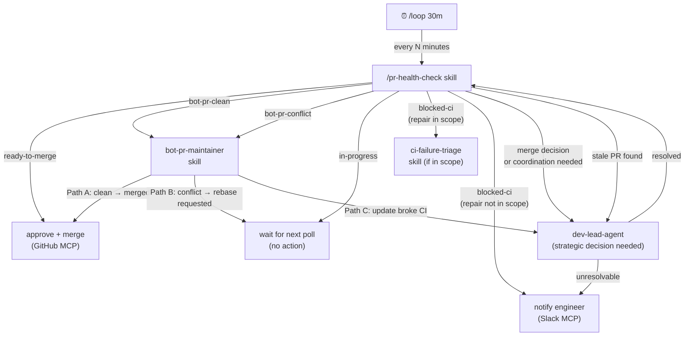
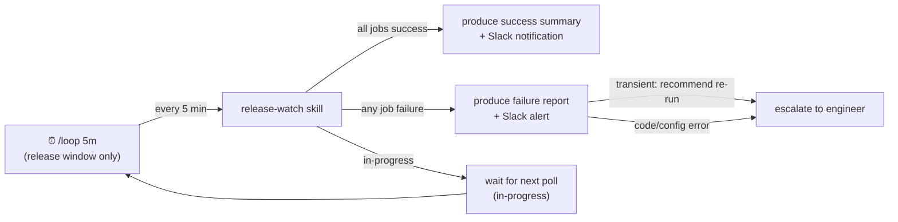

# Claude Code Engineering Agent System — Design Reference

This document covers the design rationale, architectural decisions, and known
trade-offs behind the Claude Code engineering agent system introduced in the
`claude-code-config/` upgrade. It is a companion to `CONFIGURATION-OVERVIEW.md`.

---

## 1. Design Philosophy

### Why a five-layer model?

The Claude Code kit mirrors the same engineering philosophy as the Windsurf Cascade
kit, but expressed in Claude Code's native vocabulary:

| Windsurf Layer | Claude Code Equivalent | Purpose |
|---|---|---|
| AGENTS.md | CLAUDE.md | Project truth + durable policy |
| Rules | CLAUDE.md sections | Behavioral constraints |
| Skills | `.claude/skills/` | Reusable multi-step procedures |
| MCP config | `.mcp.json` | External capability access |
| Hooks | `.claude/hooks/` + `settings.json` | Automated enforcement |

The Claude Code kit adds a **sixth layer not present in the Windsurf kit**: the
**role layer** (`.claude/agents/`), which provides sub-agent specialization for
complex multi-step engineering tasks.

### Core design concerns

**Concern 1 — Responsibility collapse**
When a single AI session handles ticket intake, implementation, testing, PR
management, and release, it inevitably makes trade-offs that collapse into
"just get it done." Specialized agents enforce strict scope boundaries, making
collapses visible as explicit delegation failures rather than silent drift.

**Concern 2 — Context contamination**
A session that has written 500 lines of implementation code thinks differently
about acceptance criteria than one that reads only the requirement and tests.
The `qa-agent` is deliberately isolated from implementation context.

**Concern 3 — Feedback loop safety**
Automated loops (PR polling, bot PR maintenance, release watching) can become
infinite self-repair cycles if agents are allowed to trigger other agents or
invoke repair skills without human checkpoints. The skill-first polling design
and hook gate-not-loop principle address this directly.

---

## 2. Agent Design Rationale

### Why four agents?

The split is derived from the four distinct cognitive modes in software engineering:

```
┌─────────────────┬────────────────────────────────────────────────┐
│ Agent           │ Cognitive mode                                  │
├─────────────────┼────────────────────────────────────────────────┤
│ dev-lead-agent  │ Strategic: what to build, when, in what order  │
│ dev-agent       │ Tactical: how to build it correctly            │
│ qa-agent        │ Skeptical: does it actually work as expected?  │
│ release-agent   │ Observational: did the automation succeed?     │
└─────────────────┴────────────────────────────────────────────────┘
```

Each mode is adversarial to the others in healthy engineering:
- The strategist wants to ship fast; the skeptic wants to slow down and verify.
- The implementer believes the code is correct; the skeptic assumes it is not.
- The observer doesn't care how the code was written; it only cares about outcomes.

Collapsing these modes into one session removes the natural tension.

### dev-lead-agent — design rationale

**Why it exists:** Complex tickets arrive as ambiguous intent. Without a
dedicated decomposition step, Claude Code starts writing code based on the
first plausible interpretation. The `dev-lead-agent` forces a clarification
and planning step before any code is written.

**Key design decision:** `dev-lead-agent` is the only agent that may make merge
decisions. This creates a single authorization point for repository mutation.

**Design concern — authority creep:** If `dev-lead-agent` starts writing code
"just to unblock" `dev-agent`, it defeats the separation. The agent's "What this
agent must not do" section enforces this boundary explicitly.

**Design concern — stale decomposition:** Task decompositions can go stale if
a dependency changes mid-sprint. `dev-lead-agent` should be re-invoked (not
`dev-agent`) when the plan needs replanning.

### dev-agent — design rationale

**Why it exists:** Implementation is a focused, narrow task. Giving an implementer
agent access to orchestration decisions (ticket state, PR merges) creates
temptation to shortcut: "I'll just merge this myself since it looks fine."

**Key design decision:** `dev-agent` runs the full validation sequence before
marking work done. It does not hand off to `qa-agent` prematurely.

**Design concern — validation skipping:** Under time pressure, `dev-agent` may
try to skip steps 1–3 of the validation sequence and jump to "done." The
`full-test-gate.sh` and `precommit-gate.sh` hooks enforce this mechanically.

**Design concern — scope creep during repair:** When CI fails, `dev-agent` may
expand the fix beyond the minimal change. The skill's Safe-Fix Guidance section
constrains this explicitly.

### qa-agent — design rationale

**Why it exists:** An agent that just implemented a feature will subconsciously
validate the implementation rather than the requirement. `qa-agent` reads the
requirement first and derives expected behavior independently.

**Key design decision:** `qa-agent` produces a structured verdict (ready/blocked
with reasons), not a vague "looks good." `dev-lead-agent` acts on the verdict,
not on `qa-agent`'s judgment about whether to merge.

**Design concern — happy-path bias:** Without explicit adversarial and boundary
scenarios in the skill, `qa-agent` will default to validating only the happy path.
The `acceptance-validation` skill forces adversarial scenario coverage.

**Design concern — blocking without action:** If `qa-agent` produces a "blocked"
verdict with uncovered edge cases, `dev-agent` needs a concrete list to act on.
The structured output format in `acceptance-validation` enforces this.

### release-agent — design rationale

**Why it is thin by design:** The external release workflow (automated tag
creation, version bumping, changelog generation) owns the release mechanics.
A thick release agent would duplicate and potentially conflict with that workflow.

**Key design decision:** `release-agent` observes and summarizes. It does not
pull levers. This makes it safe to run in a loop during a release window without
risk of double-triggering.

**Design concern — false confidence:** If the pipeline is stuck (no progress for
30+ minutes), a naive observer may report "in progress" indefinitely. The
`release-watch` skill has an explicit timeout threshold and escalation rule.

**Design concern — premature summary:** `release-agent` must not produce a
success summary until the tag is confirmed and artifacts are accessible. Checking
only that the pipeline completed is not sufficient.

---

## 3. Skill Design Rationale

### Why skills rather than agent capabilities?

Skills are reusable across agents. `dev-lead-agent` uses `pr-health-check`,
but so can an engineer invoking `/pr-health-check` directly. If PR health-check
logic lived inside the agent definition, it would be unreachable from the command
interface.

Skills also isolate concerns better: the skill carries the "how," the agent
carries the "who decides what to do with the result."

### New skill design concerns

**`task-decomposition`**
- Concern: Decomposition is only as good as the acceptance criteria. If criteria
  are missing, the skill must stop and ask rather than infer. Inferring wrong
  acceptance criteria leads to technically complete but behaviorally wrong work.
- Concern: Dependency ordering is easy to get wrong. The output format enforces
  explicit "depends on: N" markers rather than leaving ordering implicit.

**`acceptance-validation`**
- Concern: "All tests pass" is not the same as "acceptance criteria are met."
  Tests often verify implementation assumptions, not requirement fulfillment.
  The skill forces re-derivation of expected behavior from the requirement, not
  from the test suite.
- Concern: Adversarial scenarios are easy to skip. The skill makes them a
  named mandatory phase, not an optional afterthought.

**`pr-health-check`**
- Concern: Classification must be deterministic. A PR classified as
  `ready-to-merge` must meet all Auto-Merge Policy conditions, not a subjective
  assessment of "looks ready."
- Concern: Stale PR handling requires a comment before closure. Silent closures
  break contributor trust.

**`bot-pr-maintainer`**
- Concern: The two-rebase-attempt limit prevents infinite rebase loops. After
  two failures, the bot PR is escalated to the engineer.
- Concern: A bot PR with CI failure caused by the update itself must never be
  merged, even if it later becomes green through unrelated CI flakiness. The
  skill requires re-classification at each poll cycle.

**`release-preparation`**
- Concern: The skill must not create a git tag. The automated workflow owns
  tagging. If the skill creates a tag, the workflow will either fail (tag exists)
  or produce a duplicate.

**`release-watch`**
- Concern: "Pipeline completed" is not the same as "release succeeded." The skill
  must verify the tag was created and artifacts are accessible before declaring
  success.

---

## 4. Hook Design Rationale

### The gate-not-loop principle

The most important constraint on the enforcement layer is:

> **Hooks must gate, not repair. Repair belongs to skills and agents.**

A hook that detects a failure and then tries to fix it becomes a self-repair loop.
Self-repair loops are dangerous because:
- They mask root causes by auto-correcting symptoms.
- They can run indefinitely if the repair does not address the actual problem.
- They create unpredictable state changes without engineer visibility.

The four new hooks all follow the gate-not-loop pattern:

```
Hook detects condition
        │
        ├── condition OK → exit 0, let the command proceed
        │
        └── condition NOT OK → exit 2, print actionable message,
                                name the skill or command that fixes it,
                                do NOT attempt the fix itself
```

### Sentinel pattern (`full-test-gate.sh`)

The full test gate uses a sentinel file (`~/.claude/hooks/.last-test-pass`) rather
than running the test suite on every push attempt. This is intentional:

**Why not run tests inside the hook?**
- Running a full test suite synchronously inside a hook would block Claude Code
  for minutes before every `git push`.
- A hook that runs tests is also a hook that could fail tests and retry them,
  which is exactly the self-repair loop we want to avoid.

**How the sentinel pattern works:**

```
 Test suite runs (outside hook, via dev-agent or engineer)
         │
         ▼ all tests pass
 touch ~/.claude/hooks/.last-test-pass
         │
         ▼ later: Claude Code issues git push
         │
         ▼ full-test-gate.sh fires
         │
 ┌───────┴───────────────────────────────────────────────┐
 │  Is .last-test-pass newer than any source file?       │
 │                                                       │
 │  Yes → proceed. Tests were run after last change.     │
 │  No  → block. Source changed since last clean run.    │
 └───────────────────────────────────────────────────────┘
```

**Design concern — sentinel staleness:** The sentinel only captures the last
passing run. If tests pass on an older commit and then new code is added without
running tests, the sentinel will be stale and the gate will block. This is the
correct behavior — it catches exactly the case where tests were not re-run after
a change.

**Design concern — sentinel not written:** If the test runner does not write the
sentinel file, the gate will always block. The project's `CLAUDE.md` should
document the sentinel write command:

```bash
# Add to the end of your test run command (or CI local script):
touch ~/.claude/hooks/.last-test-pass
```

### Hook ordering and short-circuit behavior

The PreToolUse hook chain exits on the first blocking hook (exit 2). This means:

- `block_dangerous_commands.sh` runs first — catches the most obviously dangerous
  commands before any network calls are made.
- `freshness-gate.sh` runs second — only does a `git fetch` if the command is a
  mutation command, so it adds minimal latency for non-mutation commands.
- `full-test-gate.sh` runs third — only checks the sentinel file (fast file stat),
  not the test suite itself.
- `precommit-gate.sh` runs last — runs the full pre-commit suite, which is the
  slowest hook. Running it last avoids running it when an earlier gate would
  have blocked anyway.

### Hook failure modes and design safeguards

| Hook | If remote unreachable | If config missing | If tool missing |
|---|---|---|---|
| `block_dangerous_commands.sh` | N/A | Blocks on known patterns | N/A |
| `freshness-gate.sh` | Warns, proceeds | Skips (no upstream) | Warns, proceeds |
| `full-test-gate.sh` | N/A | Blocks (no sentinel) | N/A |
| `precommit-gate.sh` | N/A | Skips (no config file) | Warns, proceeds |
| `completion-contract.sh` | N/A | Warns only (exit 0) | N/A |

The `freshness-gate.sh` and `precommit-gate.sh` fail open (warn, proceed) when
their dependencies are missing, rather than blocking all pushes in
unconfigured environments. The `full-test-gate.sh` fails closed (blocks) because
an unknown test state is genuinely dangerous before a push.

---

## 5. Skill-First Polling Design

### Why skill-first rather than agent-first?

The time layer (recurring automation via `/loop` or scheduler) has a strong default:
**wake a skill, not a full agent.**

**Reason:** Each agent invocation starts a new context. Agents carry role definitions,
delegation rules, and reasoning about what to do next. For routine polling work
(check PR state, check pipeline state), this context overhead is wasted — the
narrow skill already knows exactly what to do.

| Approach | Context loaded | Actions available | Risk |
|---|---|---|---|
| Wake `dev-lead-agent` every 30 min | Full agent: all delegation rules, all skills | Any agent action | May take side actions beyond polling |
| Wake `/pr-health-check` every 30 min | Narrow skill: PR classification logic only | Classify PRs, act on class | Contained and predictable |

**Rule:** Wake an agent only when the skill's output requires a decision or
coordination that the skill itself cannot make.

### PR health check polling loop



### Release window polling loop

During an active release window, a separate loop runs at higher frequency:



### Loop safety rules (detailed)

**Rule 1 — No loop spawns another loop.**
A skill woken by `/loop` must not start a new `/loop`. Only the engineer or a
top-level agent session may start or extend loops.

**Rule 2 — Skills report; agents decide.**
When `pr-health-check` finds a merge decision that requires coordination, it
reports to `dev-lead-agent`. It does not make the merge decision itself.

**Rule 3 — Repair is not a loop action.**
If a loop-woken skill encounters a repairable failure (e.g., CI is red on a
human PR), it classifies the failure and notes it in the health report. It does
not invoke `ci-failure-triage` in a loop. The engineer or `dev-lead-agent` must
explicitly initiate repair.

**Exception:** Bot PR rebase (Path B in `bot-pr-maintainer`) is permitted as a
loop action because the bot will perform the rebase independently — the skill
only posts a comment. There is no risk of an infinite self-repair loop.

**Rule 4 — Loop interval discipline.**
- PR health check: max once every 15 minutes during working hours.
- Release watch: max once every 5 minutes during an open release window.
- Do not start multiple concurrent loops for the same target.

---

## 6. MCP Capability Routing

### Which agent uses which MCP capability?

MCP servers provide capabilities. Agents and skills consume those capabilities.
The routing table below shows which agent/skill uses which MCP capability and
for what purpose.

```
                                    MCP Capability
                     ┌──────────────┬──────────────────┬────────────────┬────────────────┐
                     │code_repository│ static_analysis  │issue_tracking  │communication   │
                     │ (GitHub)      │  (SonarQube)     │(GitHub/ClickUp)│  (Slack)       │
┌────────────────────┼──────────────┼──────────────────┼────────────────┼────────────────┤
│ dev-lead-agent     │ PR state,     │ quality gate     │ ticket state,  │ status updates │
│                    │ CI checks,    │ before merge     │ decomposition  │ on decisions   │
│                    │ merge/close   │ decision         │ output         │                │
├────────────────────┼──────────────┼──────────────────┼────────────────┼────────────────┤
│ dev-agent          │ PR diff,      │ code smell       │ —              │ —              │
│                    │ branch state  │ feedback         │                │                │
├────────────────────┼──────────────┼──────────────────┼────────────────┼────────────────┤
│ qa-agent           │ PR diff,      │ —                │ acceptance     │ —              │
│                    │ test output   │                  │ criteria       │                │
├────────────────────┼──────────────┼──────────────────┼────────────────┼────────────────┤
│ release-agent      │ tag state,    │ —                │ —              │ release status │
│                    │ pipeline runs │                  │                │ notifications  │
├────────────────────┼──────────────┼──────────────────┼────────────────┼────────────────┤
│ pr-health-check    │ open PRs,     │ quality gate     │ —              │ —              │
│ skill              │ CI status,    │ on ready PRs     │                │                │
│                    │ review state  │                  │                │                │
├────────────────────┼──────────────┼──────────────────┼────────────────┼────────────────┤
│ bot-pr-maintainer  │ bot PR state, │ —                │ —              │ —              │
│ skill              │ approve+merge │                  │                │                │
├────────────────────┼──────────────┼──────────────────┼────────────────┼────────────────┤
│ release-watch      │ pipeline run  │ —                │ —              │ outcome        │
│ skill              │ status, tags  │                  │                │ summary/alert  │
└────────────────────┴──────────────┴──────────────────┴────────────────┴────────────────┘

Optional capabilities (Codecov, Datadog) not shown — used by qa-agent and
release-watch when enabled.
```

### MCP state: always-on vs. disabled-by-default

```
 Always-on (enabled out of the box)
 ────────────────────────────────────────────────────────────────
 github     → core: PR management, CI state, merge operations
 fetch      → utility: URL fetching for documentation lookups
 sonarqube  → first-class quality gate: required before merge decisions

 Disabled by default (enable with project credentials)
 ────────────────────────────────────────────────────────────────
 clickup    → enable when project uses ClickUp for task tracking
              requires: CLICKUP_API_TOKEN
              image: ghcr.io/chisanan232/clickup-mcp-server:latest
              [VERIFY IMAGE README before enabling]

 slack      → enable when team uses Slack for notifications
              requires: SLACK_BOT_TOKEN, SLACK_TEAM_ID
              image: ghcr.io/chisanan232/slack-mcp-server:latest
              [VERIFY IMAGE README before enabling]

 codecov    → enable when coverage trend tracking is needed for PRs
              requires: CODECOV_TOKEN
              used by: qa-agent (acceptance-validation), pr-readiness

 datadog    → enable for production incident and log triage
              requires: DD_API_KEY, DD_APP_KEY
              not used by any agent directly; enables observability queries
```

### Design concern — SonarQube as always-on

SonarQube is the only analysis tool promoted to always-on status in this upgrade.
This is a deliberate choice with a trade-off:

**Why always-on:**
- Quality gate checks are a prerequisite for merge decisions, not optional audits.
- If SonarQube is disabled, `pr-health-check` and `pr-readiness` silently skip
  quality gate verification, creating a false impression of readiness.
- Making it always-on makes the expectation explicit: configure it or explain why
  it is not relevant.

**Trade-off:**
- Requires `SONAR_TOKEN` and `SONAR_HOST_URL` to be set for the MCP to start.
- Teams that do not use SonarQube must explicitly set `"disabled": true` to
  avoid startup errors.
- Teams using a different static analysis tool (CodeClimate, Snyk) should replace
  the `sonarqube` entry with their own server and update the `_role` note.

### Design concern — ClickUp vs. GitHub Issues

The kit provides both `github` (which covers `issue_tracking`) and `clickup`.
Teams should use one, not both, for issue tracking. The guidance:

- **If your team uses ClickUp:** Enable `clickup`, use it as the primary
  `issue_tracking` capability. Use `github` for PR and CI operations only.
- **If your team uses GitHub Issues:** The `github` server already covers
  `issue_tracking`. Do not enable `clickup`.
- **If your team uses both:** Document explicitly which system is the source
  of truth for task state. Ambiguity between two issue trackers leads to
  inconsistent ticket updates.

---

## 7. Workflow Gap Closure — What Was Added and Why

The initial Claude Code kit covered implementation and PR mechanics but left
ten gaps in the full ticket lifecycle. This section documents each gap,
what closed it, and the design concern it addresses.

### Gap map

| Gap | Gap description | What closes it | Design concern |
|---|---|---|---|
| G1 | No ticket intake or requirement discussion | `ticket-intake` skill | Prevents decomposing ambiguous tickets |
| G2 | `task-decomposition` created comments, not real sub-tickets | `task-decomposition` Phase 4 rewrite | Ensures parallel dev-agents can pick up sub-tasks independently |
| G3 | No pre-implementation ticket validation | `ticket-pickup-check` skill | Prevents duplicate assignment and blocked-ticket churn |
| G4 | No structured implementation driver with phases | `dev-impl-loop` skill | Gives every ticket a defined entry point, exit condition, and handoff |
| G5 | No explicit QA handoff trigger | Phase 4 of `dev-impl-loop` | Ensures qa-agent runs before every PR is opened |
| G6 | No PR review feedback handling | `pr-feedback-response` skill | Closes the reviewer feedback loop systematically |
| G7 | No post-merge close-out | `post-merge-close` skill | Leaves no dangling branches or open tickets after merge |
| G8 | No browser/UI testing path in qa-agent | `qa-agent` updated | E2E coverage for frontend and full-stack tickets |
| G9 | No workflow state persistence for session resumption | `workflow-state.sh` utility + `workflow-resume` skill | Interrupted sessions resume at the correct phase, not from zero |
| G10 | No circuit breaker for implementation loops | `circuit-breaker-gate.sh` hook + CLAUDE.md policy | Prevents runaway self-repair cycles from consuming unlimited resources |

### Design concern: phase-driven ticket lifecycle

Before the gap closure, the system had agents and skills but no explicit
**lifecycle scaffold** that connected them. A dev-agent could implement
without ever validating, and a qa-agent could be skipped if the dev-agent
went directly to PR creation. The `dev-impl-loop` skill closes this by
making the lifecycle explicit:

```
ticket-pickup-check
        │
        ▼
dev-impl-loop Phase 0: env verify
        │
        ▼
Phase 1: ralph loop (implement → relative tests) ──── circuit breaker (threshold: 5)
        │ all acceptance criteria green
        ▼
Phase 2: full test suite ────────────────────────── circuit breaker (threshold: 3)
        │ all green
        ▼
Phase 3: pre-commit --all-files
        │ pass
        ▼
Phase 4: explicit QA handoff signal → qa-agent acceptance-validation
        │ verdict: ready
        ▼
Phase 5: open PR via code-review-prep + pr-readiness
        │ merged
        ▼
post-merge-close: ticket → Done, branch deleted, reporter notified
```

This is not a flowchart — it is a **contract**. Each phase has a defined
entry condition and exit condition. No phase is optional. If any phase
fails to exit cleanly, the circuit breaker records it.

### Design concern: the difference between the audit log and workflow state

The existing `audit_log.sh` records **what commands ran and when**. It is
an append-only JSONL trail. It cannot answer "which phase of the ticket was
I in when the session crashed?"

`workflow-state.sh` answers a different question: **where was the skill
in its phase sequence at the last checkpoint?** The two systems are
complementary, not redundant:

| System | Records | Purpose |
|---|---|---|
| `audit_log.sh` | Every Bash command run | Security audit, debugging |
| `workflow-state.sh` | Phase transitions per ticket | Session resumption |
| Git log | Every commit with message | Code history |

---

## 8. Circuit Breaker Design

### Why a circuit breaker?

The ralph loop (`/ralph-loop`) is iterative by design — it runs until tests
pass. Without an external stopping condition, a session with a genuinely broken
test environment or an impossible-to-fix bug will iterate forever, consuming
context and tokens while making no progress.

The circuit breaker applies the same pattern used in distributed systems:
track consecutive failures; when they exceed a threshold, stop the caller
from making further attempts until an operator reviews the situation.

### States and transitions

```
              ┌─────────────────────────────────────────┐
              │                                         │
        failure                                   engineer reset
              │                                         │
              ▼                                         │
    ┌─────────────────┐   N failures   ┌─────────────────────────┐
    │                 │   ──────────►  │                         │
    │    CLOSED       │                │      OPEN               │
    │  (normal ops)   │                │  (attempts blocked)     │
    │                 │   ◄────────    │                         │
    └─────────────────┘   engineer     └─────────────────────────┘
              │           reset
          success
              │
         (reset count
          to zero,
          stay CLOSED)
```

### Threshold rationale

| Phase | Threshold | Reason |
|---|---|---|
| Phase 1 (relative tests) | 5 | More attempts allowed because test failures here are often shallow; gives room to iterate |
| Phase 2 (full suite) | 3 | Full suite failures are more likely to indicate a systemic problem; fewer attempts before escalation |
| Phase 5 (QA rejection) | 3 | Multiple QA rejections indicate scope or design misunderstanding; human judgment needed |

### Design concern: the hook vs. the skill

`circuit-breaker-gate.sh` operates as both a **PostToolUse[Bash] hook**
(passive, detecting failure markers in command output) and a **utility
script** (called explicitly by skills at phase boundaries).

The hook mode is best-effort: it reads output and tries to identify the
active ticket context. The utility mode is authoritative: skills call
`record-failure` and `record-success` explicitly at known phase checkpoints.

Both work together. The hook provides a safety net for commands run outside
a skill context; the utility provides precise tracking within a skill context.

### Design concern: what the circuit breaker does not do

The circuit breaker is a **stopping mechanism**, not a repair mechanism.
It does not:
- Analyze why failures are happening.
- Suggest fixes.
- Reset itself automatically after a cooling-off period.

This is intentional. Auto-reset after cooling off would re-enter the same
failing loop; the problem must be understood before re-attempting. Only an
engineer, after reviewing the failure summary, should reset the breaker.

---

## 9. Weak Point Fixes — Design Decisions

After the initial system was built, ten concrete weaknesses were identified
and fixed. This section records the design decision behind each fix.

### Fix 1 — Circuit breaker: remove passive hook mode

**Problem:** The `circuit-breaker-gate.sh` PostToolUse[Bash] hook tried to
identify the active ticket by reading the most recently modified state file.
This was unreliable: concurrent sessions collide on the mtime ordering, and
generic patterns like `ERROR` or `error:` fired on git messages and docker logs.

**Fix:** Remove the hook registration from `settings.json`. Keep only the
explicit utility sub-commands (`check`, `record-failure`, `record-success`,
`reset`). Skills call these at known phase boundaries — that is the only
reliable path. Passive detection of failures from arbitrary command output
is too noisy to be useful.

### Fix 2 — completion-contract: scope to test runners, exit 2

**Problem:** `exit 0` (warn only) on all commands meant the hook was purely
informational. It could not stop a session from proceeding after a red test run.
Broad failure markers (`ERROR`, `error:`) produced false positives on non-test commands.

**Fix:** Add a test-runner allowlist (pytest, jest, go test, cargo test, etc.).
Only fire for commands matching the list. Change exit code to `2` (block next
Bash call) when a test runner produces failure output. Non-test commands are
unaffected.

### Fix 3 — Sentinel: per-repo/branch scoping and git-based freshness

**Problem:** A single global sentinel at `~/.claude/hooks/.last-test-pass`
meant passing tests in repo A would clear the push gate in repo B. `find -newer`
traversed the entire filesystem including node_modules — slow and fragile.

**Fix:** Scope sentinel path to `~/.claude/sentinels/<repo-sha12>/<branch>/`
using the git remote URL as a stable, deterministic key. Replace `find` with
`git diff HEAD --name-only` (uses git index, O(1), git-aware) and last commit
mtime comparison.

### Fix 4 — Workflow state: atomic writes and JSON validation

**Problem:** `cat > file` is not atomic — a crash mid-write produces a partial
file with invalid JSON. The `read` sub-command returned the corrupt file without
validation, causing `workflow-resume` to silently parse empty fields.

**Fix:** Write via `mktemp` + `mv` (POSIX-atomic on the same filesystem).
Validate JSON on read using `python3 json.load`; exit 1 with recovery
instructions when corrupt. Recovery path: delete the file and restart from
`ticket-pickup-check`.

### Fix 5 — Ticket context: `.claude/.current-ticket` bootstrap file

**Problem:** Skills referenced `[ticket-ref]` as a placeholder with no
mechanism to propagate it from the session start. Each skill had to re-derive
it independently.

**Fix:** `ticket-pickup-check` writes the ticket ref to `.claude/.current-ticket`
and exports `CLAUDE_CURRENT_TICKET`. All skills resolve using a three-step
priority: env var → file → prompt. `CLAUDE_CURRENT_TICKET` takes precedence
for CI pipelines where the ticket is known externally.

### Fix 6 — Issue tracker: `CLAUDE_ISSUE_TRACKER` routing

**Problem:** Both `github` and `clickup` MCP servers provided the
`issue_tracking` capability. Skills said "use GitHub MCP or ClickUp MCP" with
no routing rule — the agent would always pick GitHub.

**Fix:** `CLAUDE_ISSUE_TRACKER=github|clickup` (default: `github`) in
`config.env`. `_role` annotations in `.mcp.json` document the routing intent.
Only one `issue_tracking` provider should be active at a time.

### Fix 7 — Browser testing: Playwright MCP (not Puppeteer)

**Problem:** `qa-agent` listed browser testing in its responsibilities but had
no tools to execute it. The Puppeteer MCP (`@modelcontextprotocol/server-puppeteer`)
referenced in earlier design is **deprecated and archived**.

**Fix:** Add `@microsoft/playwright-mcp` (30k+ stars, active Microsoft
maintenance) as `disabled: true` in `.mcp.json`. Default browser: Chrome.
Uses accessibility tree rather than screenshots — no vision model required,
LLM-friendly, deterministic. Wire into `qa-agent.md` Tools section. Enable
per-project for web UI acceptance testing.

### Fix 8 — Decision log: structured WHY record

**Problem:** The audit log records what Bash commands ran. Workflow state
records what phase was reached. Neither records why a decision was made —
which path was chosen, what the test output showed, why the agent escalated.

**Fix:** `decision-log.sh record` writes structured JSONL entries to
`~/.claude/decisions/<date>.jsonl`. Each entry captures: ticket, agent, skill,
phase, decision (proceed/escalate/qa-handoff/etc.), reason, and a context
snippet. Queryable via `tail` and `query --ticket`. Integrated into all
phase transitions in `dev-impl-loop`. Configurable via `CLAUDE_DECISION_LOG_*`
env vars; disableable for lean/CI environments.

### Fix 9 — Escalation SLA: status field and resume surfacing

**Problem:** When a skill escalated ("circuit open — report to dev-lead-agent"),
it wrote nothing to the state file. The escalation was a message in a session
that might not be running. There was no way to see unresolved escalations when
resuming a session.

**Fix:** Skills write `status=escalated` with an `escalation_reason` to the
workflow state file when tripping the circuit breaker. `workflow-resume` reads
this status first and surfaces a visible block with the reason, timestamp, and
required reset steps before allowing any resumption.

### Fix 10 — post-merge-close: idempotent checkpoint

**Problem:** If `post-merge-close` failed mid-way (e.g., ticket closed but
Slack call timed out), re-running would attempt to close an already-closed
ticket and potentially try to delete an already-deleted branch. No record of
what had completed.

**Fix:** Each step writes completion to `~/.claude/merge-closeout/<pr>.json`
via atomic `os.replace`. Re-running reads the checkpoint and skips completed
steps. Operations are naturally idempotent (closing a closed ticket, deleting
a deleted branch both return benign results) so re-runs are always safe.
Checkpoint is cleaned up on successful final step.

### The config.env pattern

All ten fixes introduce new configurable paths and thresholds. Rather than
scattering `${VAR:-default}` across scripts with inconsistent defaults, a
single `config.env` template is sourced by every hook and utility:

```bash
[ -f "${HOME}/.claude/config.env" ] && source "${HOME}/.claude/config.env"
```

Users copy `claude-code-config/.claude/hooks/config.env` to `~/.claude/config.env`
and uncomment the variables they need. External env vars always take precedence
(useful for CI). The full variable reference is in `CLAUDE.md §Environment Variable Reference`.

---

## 10. Configuration Layering: Global vs Project

### Why global-first?

The Claude Code kit is designed to install once at `~/.claude/` and apply to all
projects. This avoids the copy-paste problem: if the same behavioral rules and
agent definitions live in every repo, they drift independently and become
inconsistent over time.

**The cost without global install:**
- Repos created six months apart have different hook versions.
- The circuit breaker threshold in repo A is 5; in repo B it's the old default 3.
- A skill improved in one repo never propagates to others.
- Engineers onboarding to a new repo must re-read configuration they already know.

**The benefit of global install:**
- All repos share the same behavioral contract by default.
- Improvements to the global file apply everywhere without per-repo changes.
- Per-repo configuration is minimal — only what genuinely differs.

### Layering rule

```
~/.claude/CLAUDE.md            read first — global behavioral rules
       ↓
.claude/CLAUDE.md              read second — project overrides
       ↓
Claude Code applies the merged result, with project values taking precedence
```

Claude Code reads `CLAUDE.md` files in this order. The project file does not
replace the global file — it extends it. Sections not present in the project file
fall back to the global definition.

### What lives at each layer

```
Global ~/.claude/CLAUDE.md                Project .claude/CLAUDE.md
─────────────────────────────             ─────────────────────────────────────
Global vs Project Configuration           Repository Identity
Safe Implementation Policy                Architecture Constraints
Testing Expectations (principles)         Package and Build Commands
Type Checking Policy (principles)         Testing Tooling (runner, coverage %)
Linting and Formatting (principles)       Type Checker (mypy/tsc/etc.)
Commit Policy                             Linter (ruff/eslint/golangci/etc.)
Pull Request Policy                       Source-of-Truth Systems
CI/CD Triage Expectations                 Merge Strategy (squash/rebase/merge)
MCP-Backed Systems                        Polling Intervals (per-project cadence)
Auto-Merge Policy                         Language-Specific Repair Skills
Bot PR Policy
Push Gate Policy
Development Preconditions
Release Operations Policy
Time-Layer Design
Environment Variable Reference
Agent Delegation Model
Skill Invocation Guide
Workflow State Management
Circuit Breaker Policy
```

### Practical example: adding a new project

```bash
# 1. Clone the repo
git clone https://github.com/org/my-new-service

# 2. Add project-level CLAUDE.md (30-minute task)
mkdir -p my-new-service/.claude
cat > my-new-service/.claude/CLAUDE.md << 'EOF'
## Repository Identity
- **Repository**: my-new-service
- **Purpose**: REST API for order processing
- **Primary language**: Go 1.22

## Architecture Constraints
- All database access through `internal/repository/`
- HTTP handlers in `internal/handler/`; no business logic in handlers

## Package, Build, and Run Commands
```bash
go mod download              # install
go test ./... -count=1       # full test suite
golangci-lint run            # lint
go vet ./...                 # type/vet check
```

## Testing Tooling
- Runner: `go test`; coverage: `go test -coverprofile`
- Table-driven tests preferred; no test framework

## Source-of-Truth Systems
- GitHub Issues: https://github.com/org/my-new-service/issues

## Merge Strategy
- All PRs: rebase merge

## Language-Specific Repair Skills
- `go-golangci-fixing` — golangci-lint violations
- `go-vet-debugging` — go vet errors
EOF

# 3. Gitignore the ticket file
echo ".claude/.current-ticket" >> my-new-service/.gitignore
```

Claude Code now applies the global behavioral rules to this repo, with Go-specific
commands and architecture constraints from the project file.

### Design concern — global file changes affect all projects

A change to `~/.claude/CLAUDE.md` applies to every project immediately. This is
the right default for policy improvements (bug fix in circuit breaker threshold,
improved commit message guidance), but it means global changes must be made
carefully.

**Guidance for safe global updates:**
- Changes to behavioral principles (Safe Implementation Policy, Push Gate Policy)
  are safe — they apply universally and improve all projects.
- Changes that reference specific tooling or commands must not go in the global
  file — they belong in each project's `.claude/CLAUDE.md`.
- Test global file changes on a low-stakes project before relying on them broadly.

---

## 11. Further Reading

| Document | What it covers |
|---|---|
| `CONFIGURATION-OVERVIEW.md` | Full directory structure, hook wiring, MCP map, global/project split |
| `~/.claude/CLAUDE.md` | 21-section global constitution — behavioral rules applied to all projects |
| `claude-code-config/.claude/agents/dev-lead-agent.md` | Full dev-lead-agent responsibilities |
| `claude-code-config/.claude/agents/dev-agent.md` | Full dev-agent responsibilities |
| `claude-code-config/.claude/agents/qa-agent.md` | Full qa-agent responsibilities |
| `claude-code-config/.claude/agents/release-agent.md` | Full release-agent responsibilities |
| `docs/architecture-rationale.md` | Windsurf Cascade layer model rationale |
| `docs/mcp-integration.md` | MCP capability model and integration guidance |
